# 🎬 CineWeb

A comprehensive cinema management and online ticket reservation system built with **ASP.NET Core MVC**, **ASP.NET Core Web API**, and **PostgreSQL**.

---

## 🚀 About the Project

CineWeb is a full-featured cinema management system developed using **ASP.NET Core MVC**, **ASP.NET Core Web API**, and **PostgreSQL**. The application allows users to browse movies currently in theaters, view movie details, select showtimes and seats, securely purchase tickets, and manage their profiles. The system also includes a comprehensive administration panel for managing movies, halls, showtimes, users, and roles.

The project follows a **Layered Architecture** and was developed with a focus on scalability, maintainability, security, and performance.

---

## ✨ Features

- 🎬 Browse movies currently in theaters
- 📄 Movie detail pages
- 🎟️ Online ticket purchasing
- 💺 Seat selection and reservation
- 👤 User registration and authentication
- 🔐 JWT Authentication
- 🛡️ ASP.NET Identity integration
- 📧 Automatic ticket delivery via email
- ⭐ Movie review and rating system
- ❤️ Review likes and replies
- 🏆 Badge & achievement system
- 🛠️ Administration panel
- 🎥 Movie, hall and showtime management
- 👥 User & role management

---

## 🛠️ Technologies Used

- ASP.NET Core MVC
- ASP.NET Core Web API
- C#
- Entity Framework Core
- PostgreSQL
- ASP.NET Identity
- JWT Authentication
- HTML5
- CSS3
- JavaScript
- Bootstrap
- SMTP Mail
- DBeaver

---

## 🏗️ Architecture

- Layered Architecture
- Repository Pattern
- REST API
- Entity Framework Core
- Dependency Injection
- Role-Based Authorization

---

## 📦 Main Modules

### 👤 User

- User Registration
- User Login
- Profile Management

### 🎬 Cinema

- Movie Listing
- Movie Details
- Showtimes
- Halls
- Seat Reservation

### 🎟️ Ticketing

- Online Ticket Purchase
- Email Ticket Delivery

### ⭐ Social Features

- Movie Reviews
- Review Replies
- Like System
- Badge System

### 🛠️ Administration

- Movie Management
- Hall Management
- Showtime Management
- User Management
- Role Management

---

## 🔐 Security

- JWT Authentication
- ASP.NET Identity
- Role-Based Authorization
- Model Validation
- Entity Framework Constraints
- Unique Indexes
- Secure Password Hashing

---

# 📸 Screenshots

## 🏠 Home Page

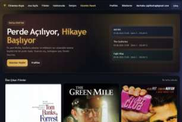

---

## 🎬 Movie Details

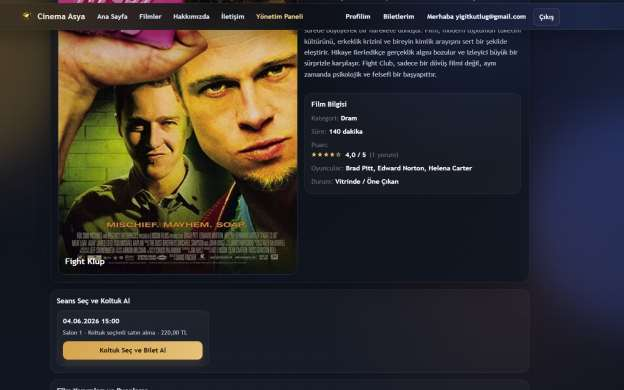

---

## 💺 Seat Selection

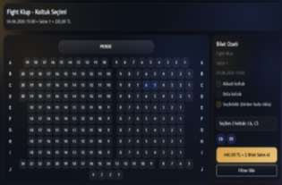

---

## ✅ Purchase Successful

---

## 🔑 Login

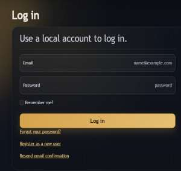

---

## 📝 Register

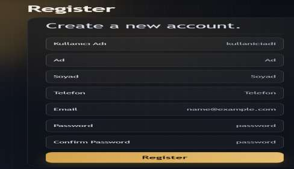

---

## 👤 User Profile

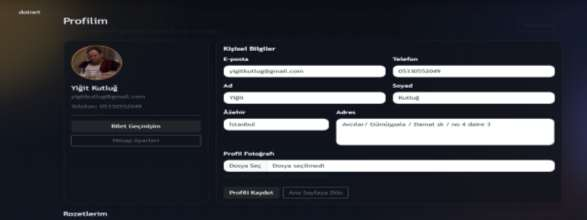

---

## 🏆 Badge System

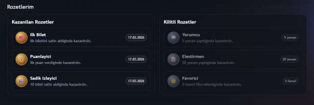

---

## 📧 Ticket Email

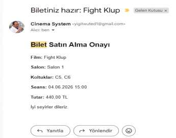

---

## 🛠️ Admin Dashboard

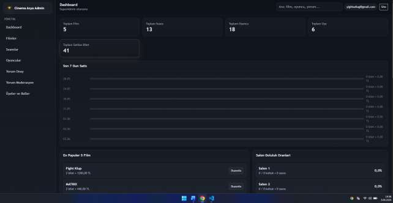

---

## 🎬 Movie Management

---

## 📅 Showtime Management

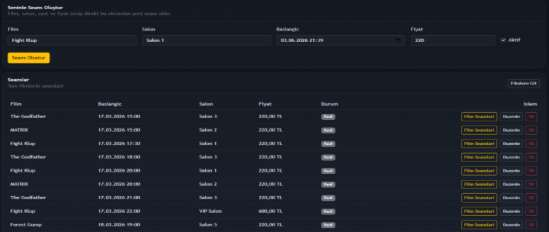

---

## 🏢 Hall Management

---

## 👥 User Management

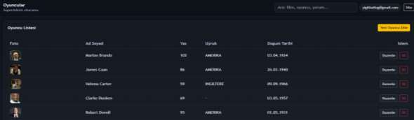

---

## 🔐 Role Management

---

## 📊 Database

The application uses **PostgreSQL** with **Entity Framework Core** and includes relational tables such as:

- Movies
- Showtimes
- Halls
- Seats
- Tickets
- Users
- Reviews
- Badges

Database schema management is handled through **Entity Framework Core Migrations**.

---

## 🚀 Future Improvements

- 💳 Online Payment Integration
- 📱 QR Code Ticket Verification
- ⚡ SignalR Real-Time Seat Updates
- ❤️ Favorite Movies
- 🔔 Notification System
- 🌍 Multi-language Support
- 🐳 Docker Deployment

---

## 👨‍💻 Developer

**Yiğit Kutluğ**

Computer Engineer

GitHub: https://github.com/yigitkutlug

---

## 📄 License

This project was developed for educational and portfolio purposes.
